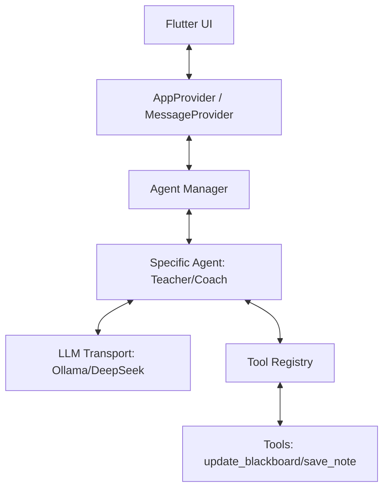

# LLM 通信架构与对话流程设计方案

本方案旨在为“小书童”构建一个高效、可扩展且支持流式输出的 AI 通信架构。参考现代 AI CLI（如 Gemini CLI）的设计思路，我们将系统解耦为传输层、消息管理层、Agent 层和工具调用层。

## 1. 核心架构图 (逻辑分层)



## 2. 传输层 (Transport Layer) - 局域网 Ollama 优先

为了保证测试阶段的响应速度和成本控制，默认连接局域网内的 Ollama 服务。

- **OllamaClient**: 负责与 `http://<LAN_IP>:11434` 通信。
- **流式支持**: 使用 `ndjson` (Newline Delimited JSON) 解析 Ollama 的 `/api/chat` 流。
- **健康检查**: 启动时自动检测 Ollama 状态，若失败则切换至备用 DeepSeek API。

## 3. 消息与对话模型 (Message Model)

扩展现有的 `Message` 模型，支持多角色和工具状态。

- **Roles**: `system` (设定), `user` (提问), `assistant` (回答), `tool` (工具执行结果)。
- **Message 结构**:
  ```dart
  class ChatMessage {
    final String role; // system, user, assistant, tool
    final String content;
    final List<ToolCall>? toolCalls; // AI 请求调用的工具
    final String? toolCallId; // 对应 tool 角色的 ID
  }
  ```

## 4. Agent 与工具系统 (Agent & Tool System)

参考现代架构，将 Agent 定义为“带有特定 System Prompt 和工具集的独立实体”。

### Agent 设计
- **BaseAgent**: 提供统一的 `processStream(String input)` 接口。
- **MathTeacherAgent**: 系统提示词强调“引导式教学”，拥有 `update_blackboard` 工具。
- **HomeworkCheckerAgent**: 专注于错误识别，拥有 `mark_workbook` 工具。

### 工具注册 (Function Calling)
- 工具定义采用标准 JSON Schema。
- **自动派发**: 当 LLM 返回 `tool_calls` 时，`AgentManager` 自动解析并调用本地对应的逻辑（如：更新 Provider 中的黑板状态）。

## 5. 流式对话流程 (Stream Flow)

实现真正的“打字机”效果：

1. **用户发送**: UI 调用 `Provider.sendMessage()`.
2. **流式开启**: `Agent` 向 `Ollama` 发起请求，获取 `Stream<ChatChunk>`.
3. **实时更新**:
   - 如果 chunk 是文字内容，立即 append 到当前消息并通知 UI 刷新。
   - 如果 chunk 是工具调用片段，累积直至完整。
4. **工具执行**: 完整解析出 `tool_call` 后，立即在本地执行（如：黑板上出现题目），并将结果作为下一条消息回传给 LLM（如果需要）。

## 6. 局域网连接配置 (LAN Config)

在应用设置中增加一个 `Ollama 终端地址` 配置项，默认为 `http://localhost:11434`。在局域网测试时，用户可以手动输入电脑的局域网 IP（例如 `http://192.168.1.5:11434`）。

## 7. 开发路线建议

1. **第一步**: 重构 `ai_service.dart` 为 `OllamaClient`，实现流式读取。
2. **第二步**: 升级 `Message` 和 `Conversation` 模型，支持 `role` 切换。
3. **第三步**: 实现简单的 `ToolRegistry`，先跑通 `update_blackboard`。
4. **第四步**: 封装 `Agent` 类，支持动态切换教学角色。
